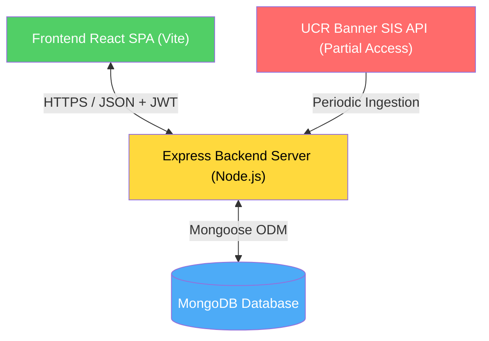
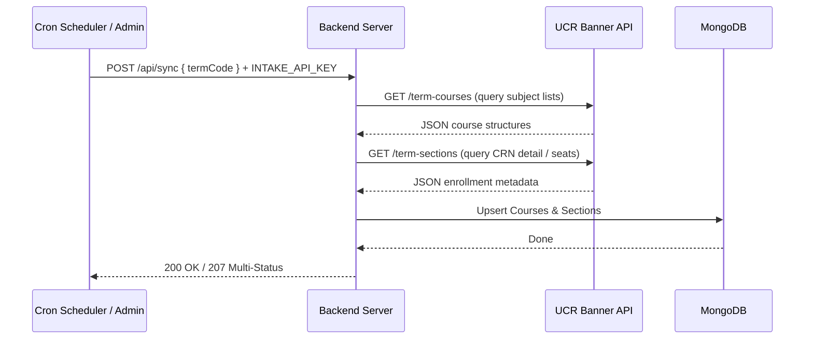

# Technical Specifications — UCR Scheduling Aid

> **Version:** 1.0
> **Last Updated:** 2026-07-15
> **Status:** Approved

This document details the software architecture, database schema, algorithmic specifications, and integration workflows for the UCR Scheduling Aid.

---

## 1. System Architecture

The application is structured as a decoupled client-server web app:



### 1a. Technology Stack
- **Frontend**: React 19, TypeScript 6, Vite 8, Tailwind CSS 4, React Router DOM 7, shadcn/ui components.
- **Backend**: Node.js, Express, Mongoose (MongoDB ODM).
- **Database**: MongoDB.
- **Data Ingestion**: Axios/Node-fetch client querying the UCR Banner SIS API, using cron scripts.

---

## 2. Database Schema (Mongoose Models)

Based on the contract in `BACKEND_API.md`, the MongoDB schemas are defined as follows.

### 2a. User Schema
```typescript
const UserSchema = new Schema({
 email: { type: String, required: true, unique: true, lowercase: true, trim: true },
 password: { type: String, required: true }, // Hashed with bcrypt
 displayName: { type: String, required: true },
}, { timestamps: true });
```

### 2b. Course Schema
```typescript
const CourseSchema = new Schema({
 subject: { type: String, required: true }, // e.g., "CS"
 courseNumber: { type: String, required: true }, // e.g., "010A"
 title: { type: String, required: true },
 creditHours: {
 low: { type: Number, required: true },
 high: { type: Number, required: true }
 },
 description: { type: String },
 college: { type: String }, // e.g., "CENG"
 department: { type: String } // e.g., "Computer Science"
});
```

### 2c. Section Schema
```typescript
const MeetingTimeSchema = new Schema({
 weekDays: [{ type: String, enum: ["M", "T", "W", "R", "F", "S", "U"] }],
 startTime: { type: String, required: true }, // HH:mm (24-hour clock)
 endTime: { type: String, required: true }, // HH:mm (24-hour clock)
 meetingType: {
 code: { type: String },
 description: { type: String }
 },
 buildingDescription: { type: String },
 room: { type: String }
});

const SectionSchema = new Schema({
 courseId: { type: Schema.Types.ObjectId, ref: 'Course', required: true },
 crn: { type: String, required: true }, // Unique per termCode
 sectionNumber: { type: String, required: true }, // e.g., "LEC 1", "DIS 1B"
 termCode: { type: String, required: true }, // e.g., "202620"
 subject: { type: String, required: true },
 courseNumber: { type: String, required: true },
 courseTitle: { type: String, required: true },
 creditHours: { type: Number, required: true },
 scheduleType: {
 code: { type: String, enum: ["LEC", "DIS", "LAB", "SEM", "IND"] },
 description: { type: String }
 },
 instructor: { type: String },
 meetingTimes: [MeetingTimeSchema],
 enrollmentMax: { type: Number, required: true },
 enrollmentCurrent: { type: Number, required: true },
 waitlistTotal: { type: Number, default: 0 },
 waitlistRemaining: { type: Number, default: 0 },
 status: { type: String, enum: ["Open", "Closed", "Waitlisted"], required: true },
 campus: { type: String },
 requirementDesignation: { type: String }, // Breadth code (e.g., "BEAD")
 linkIdentifier: { type: String, default: null } // Groups lectures with labs/discussions
});

// Indexes for performance
SectionSchema.index({ crn: 1, termCode: 1 }, { unique: true });
SectionSchema.index({ subject: 1, courseNumber: 1 });
SectionSchema.index({ requirementDesignation: 1 });
```

### 2d. Schedule Schema
```typescript
const ScheduleSchema = new Schema({
 userId: { type: Schema.Types.ObjectId, ref: 'User', required: true },
 name: { type: String, required: true },
 termCode: { type: String, required: true },
 sectionIds: [{ type: Schema.Types.ObjectId, ref: 'Section' }]
}, { timestamps: true });

ScheduleSchema.index({ userId: 1, termCode: 1 });
```

### 2e. Requirement Schema
```typescript
const RequirementSchema = new Schema({
  code: { type: String, required: true, unique: true }, // e.g., "BEAD"
  description: { type: String, required: true } // e.g., "EN-ABET Depth"
});
```

### 2f. Prerequisite Schema
```typescript
const PrerequisiteSchema = new Schema({
  courseId: { type: Schema.Types.ObjectId, ref: 'Course', required: true },
  requiredCourseId: { type: Schema.Types.ObjectId, ref: 'Course', required: true },
  minGrade: { type: String, default: "D-" },
  concurrentAllowed: { type: Boolean, default: false },
  logicGroup: { type: String, required: true } // e.g., "group1"
});

PrerequisiteSchema.index({ courseId: 1 });
```

---

## 3. Core Algorithmic Logic

### 3a. Time Conflict Detection
Two sections conflict if they share at least one weekday and their time intervals overlap.

Let interval A be $[S_A, E_A]$ and interval B be $[S_B, E_B]$ where times are converted to minutes from midnight (e.g., `08:00` = $480$, `17:50` = $1070$).

Overlap Condition:
$$\text{Overlap} = (\text{weekDays}_A \cap \text{weekDays}_B \neq \emptyset) \land (S_A < E_B) \land (S_B < E_A)$$

```typescript
function hasTimeConflict(timeA: MeetingTime, timeB: MeetingTime): boolean {
 const commonDays = timeA.weekDays.filter(day => timeB.weekDays.includes(day));
 if (commonDays.length === 0) return false;

 const toMinutes = (timeStr: string) => {
 const [hrs, mins] = timeStr.split(":").map(Number);
 return hrs * 60 + mins;
 };

 const startA = toMinutes(timeA.startTime);
 const endA = toMinutes(timeA.endTime);
 const startB = toMinutes(timeB.startTime);
 const endB = toMinutes(timeB.endTime);

 return startA < endB && startB < endA;
}
```

### 3b. Schedule Combination Generator (`POST /generate`)
The generator uses a backtracking depth-first search (DFS) algorithm to find combinations.

#### Input Parameters
- `courseIds` (array of strings): List of course database IDs to compile schedules for.
- `termCode` (string): Active registration term identifier (e.g., `"202620"`).
- `lockedSectionIds` (array of strings, optional): MongoDB ObjectIds of sections the user has pinned.

#### Output Schema
The generator returns an array of `GeneratedSchedule` objects conforming to the `BACKEND_API.md` output contract:
- `totalUnits` (number): Sum of credit hours across all sections.
- `totalClassMinutes` (number): Total duration of classroom instruction.
- `earliestStart` (string): Earliest class start time formatted as `"HH:mm"`.
- `latestEnd` (string): Latest class end time formatted as `"HH:mm"`.
- `activeDays` (array of strings): Weekdays containing scheduled classes (e.g., `["M", "W", "F"]`).
- `daysOff` (array of strings): Weekdays containing no scheduled classes.
- `totalGapMinutes` (number): Sum of all intervals between back-to-back classes.
- `groups` (array of objects): List of courses containing:
  - `courseId` (string): Parent course ID.
  - `subject` (string): e.g., `"CS"`.
  - `courseNumber` (string): e.g., `"010A"`.
  - `title` (string): e.g., `"Introduction to Computer Science"`.
  - `creditHours` (object): containing `{ low, high }`.
  - `sections` (array of objects): Full details of selected sections, including a list of calendar `blocks` (formatted as `{ day, start, end }` where start/end represent minutes from midnight).

#### Algorithm Steps
1. **Load Constraints**: Initialize the backtracking state by pre-loading all sections corresponding to `lockedSectionIds` into the current schedule workspace. Any course components belonging to these sections are marked as locked.
2. **Fetch Candidate Sections**: Retrieve all active sections from the database for the remaining `courseIds` and `termCode`.
3. **Group by Course and Type**: Within each course, sections must be separated by their schedule type. If a course has a `Lecture` component and a linked `Discussion` component, they must be treated as separate decision nodes.
4. **Link Dependency Checks**: Resolve links. If a lecture has a `linkIdentifier` (e.g., `"A"`), only matching discussions/labs with `linkIdentifier: "A"` or matching dependencies can be selected.
5. **Backtracking Permutation Search**:
   - Maintain a list of current selected sections. Start with all `lockedSectionIds` pre-loaded.
   - For the next unsigned course component (e.g., `CS 010A Discussion`):
     - Iterate through its sections.
     - Verify no time conflict exists with any currently selected section.
     - Verify linked section constraints match.
     - If safe, recursively advance to the next course component.
     - If a branch fails, backtrack and try the next section.
   - If all course components are successfully assigned, compute the schedule metrics (`totalUnits`, `totalClassMinutes`, `totalGapMinutes`, etc.) and push the resulting combination to the results array.

```
DFS Tree Visualization:

                     [Locked Sections (Fixed)]
                                |
                   +------------+------------+
                   |                         |
            Lecture Sec 1             Lecture Sec 2
                   |                         |
             +-----+-----+             +-----+-----+
             |           |             |           |
          Lab A1      Lab A2        Lab B1      Lab B2
          (Valid)    (Conflict)     (Valid)     (Valid)
             |           X             |           |
         [Combo #1]                [Combo #2]  [Combo #3]
```

---

## 4. Integration & Ingestion Workflow

### 4a. Sync Endpoint (`POST /sync`)
The sync endpoint handles periodic caching of course listings and seat numbers.



### 4b. Sync Frequency
- **Registration Phase**: Every 15-30 minutes. Updates section enrollment states (`enrollmentCurrent`, `waitlistTotal`, `status`).
- **Standard Phase**: Once daily. Updates static catalog detail and directory listings.

---

## 5. Security & Deployment

### 5a. Key Environment Variables
- `PORT`: Server port (default 3000).
- `MONGODB_URI`: Connection string for the MongoDB instance.
- `JWT_SECRET`: Secret key for signing authorization tokens.
- `INTAKE_API_KEY`: Key protecting synchronization routes from public triggers.

### 5b. Build & Production Commands
- **Frontend Development**: `npm run dev` (runs Vite server).
- **Frontend Production Build**: `npm run build` (transpiles and builds static bundle to `/dist`).
- **Backend Development**: `npm run start` or `nodemon server.js`.
- **Unit Tests**: `npm run test` (runs Vitest suites for combination logic and conflicts).

---

## Revision History

| Date | Version | Changes |
|---|---|---|
| 2026-07-15 | 1.0 | Initial specifications compiled for architecture, database schemas, and generation engine. |
